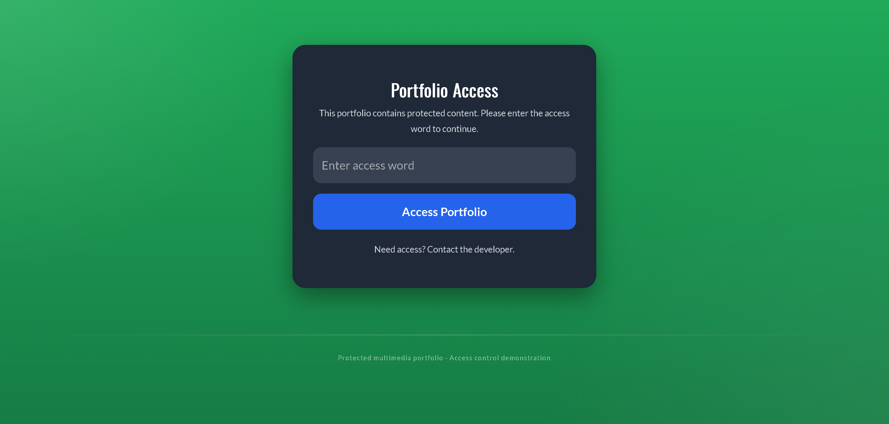
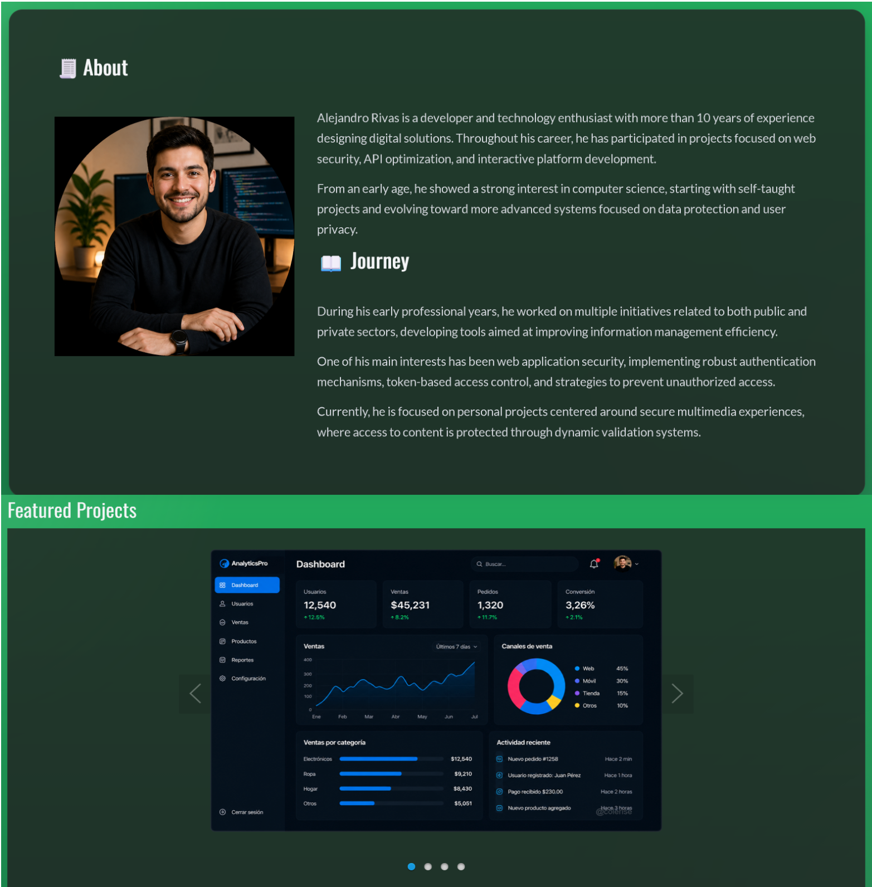
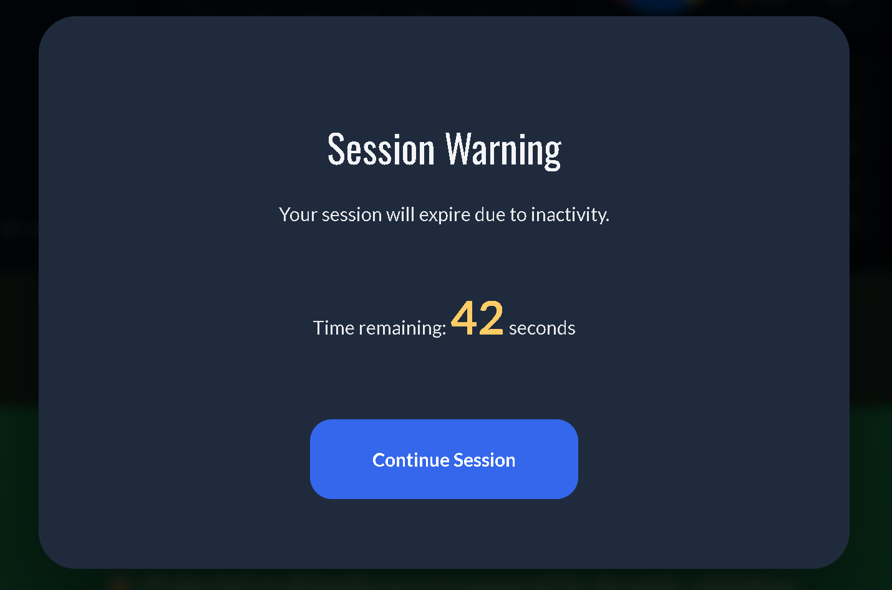

# Portafolio Multimedia Seguro

Aplicación web desarrollada con Node.js, Express y JavaScript puro que demuestra técnicas de distribución segura de contenido multimedia mediante mecanismos de acceso controlado y la aplicación práctica de controles de seguridad web.

## Descripción del proyecto

Los portafolios tradicionales suelen exponer contenido multimedia mediante enlaces directos que pueden ser compartidos, indexados o reutilizados sin control.

Este proyecto aborda ese problema implementando un proceso de validación previo al acceso del contenido protegido. Los recursos privados son entregados mediante mecanismos controlados por el backend, incluyendo sesiones seguras y URLs firmadas de corta duración para recursos multimedia.

El objetivo es reducir la exposición directa de recursos privados y aplicar conceptos prácticos de desarrollo seguro en un escenario real.

---

## Capturas de pantalla

### Validación de acceso

El usuario debe completar una validación antes de acceder al contenido protegido.



### Portafolio multimedia protegido

El contenido privado se entrega mediante mecanismos de acceso controlado y recursos protegidos con URLs temporales.



### Gestión de sesiones por inactividad

La aplicación detecta períodos de inactividad, advierte al usuario y finaliza automáticamente las sesiones inactivas.



---

## ¿Cómo funciona?

1. El usuario accede al portafolio.
2. Se solicita una palabra de acceso.
3. El backend valida la respuesta.
4. Se establece una sesión segura.
5. El contenido protegido es solicitado mediante APIs autenticadas.
6. El backend genera URLs firmadas para imágenes privadas.
7. Los recursos multimedia son entregados de forma controlada.
8. La sesión finaliza automáticamente tras un período de inactividad.

---

## Características principales

* Validación de acceso mediante palabra de acceso.
* Gestión segura de sesiones mediante cookies HTTP-Only.
* Entrega controlada de contenido multimedia.
* Cierre automático de sesión por inactividad.
* Sistema de advertencia previo a la expiración.
* Protección de recursos mediante URLs firmadas.
* Registro de eventos relevantes para auditoría y diagnóstico.
* Frontend desarrollado sin frameworks.

---

## Aspectos destacados de seguridad

* Gestión de sesiones mediante cookies HTTP-Only.
* URLs firmadas con expiración automática.
* Protección CSRF.
* Limitación de solicitudes para reducir automatización y fuerza bruta.
* Incremento progresivo del tiempo de espera tras intentos fallidos.
* Validación y sanitización de entradas.
* Cabeceras de seguridad alineadas con OWASP.
* Recursos privados fuera del acceso público directo.
* Manejo centralizado de errores.
* Registro estructurado de eventos relevantes para auditoría y diagnóstico.

---

## Arquitectura

La solución utiliza una arquitectura por capas orientada a la mantenibilidad y separación de responsabilidades.

### Frontend

Responsable de:

* Validación de acceso.
* Renderizado dinámico del contenido protegido.
* Gestión del ciclo de vida de la sesión.
* Detección de inactividad.
* Consumo seguro de APIs.
* Carga optimizada de contenido multimedia.

### Backend

#### Routes

Definen los puntos de entrada de la aplicación.

#### Controllers

Implementan la lógica de autenticación, gestión de sesiones y entrega de contenido protegido.

#### Middleware

Gestionan:

* Autenticación y autorización.
* Protección CSRF.
* Validación de entradas.
* Limitación de solicitudes.
* Cabeceras de seguridad.
* Registro de eventos.
* Manejo global de errores.

#### Services

Encapsulan la generación y validación de tokens.

#### Utilities

Agrupan funcionalidades auxiliares de auditoría, métricas y protección multimedia.

#### Views

Plantillas encargadas de presentar contenido público y contenido protegido accesible únicamente tras la validación de acceso.

#### Recursos protegidos

Los archivos privados permanecen fuera del acceso público directo y solo pueden ser obtenidos mediante mecanismos de validación implementados por el backend.

---

## Tecnologías utilizadas

| Capa       | Tecnologías              |
| ---------- | ------------------------ |
| Frontend   | HTML, CSS, JavaScript    |
| Backend    | Node.js, Express         |
| Seguridad  | JWT, CSRF, Rate Limiting |
| Despliegue | Vercel                   |

---

## Instalación

```bash
git clone https://github.com/tierrasagrada/secure-multimedia-portfolio-demo

cd secure-multimedia-portfolio-demo

npm install

npm run dev
```

## Variables de entorno

Crear un archivo `.env` utilizando `.env.example` como referencia.

---

## Posibles evoluciones

* Migración a una galería multimedia propia para mejorar mantenibilidad, rendimiento y control de la interfaz.
* Carga diferida (lazy loading) de contenido embebido.
* Gestión distribuida de sesiones mediante Redis.
* Persistencia de eventos de seguridad y registros de auditoría.
* Panel de monitoreo con métricas, gráficos y estadísticas de seguridad.
* Alertas automáticas ante eventos de seguridad relevantes.
* Mitigación avanzada de abuso mediante rate limiting distribuido.

---

## Competencias demostradas

* Desarrollo de APIs REST con Node.js y Express.
* Distribución segura de contenido multimedia.
* Implementación de autenticación y autorización.
* Implementación de controles de seguridad alineados con OWASP.
* Mitigación de fuerza bruta.
* Gestión del ciclo de vida de sesiones.
* Arquitectura backend por capas.
* Desarrollo frontend con JavaScript puro.
* Despliegue cloud mediante Vercel.
* Implementación de logging estructurado para auditoría y diagnóstico.

---

### Nota

Este proyecto fue desarrollado como iniciativa personal con el objetivo de aplicar conceptos prácticos de seguridad web en un escenario real de distribución controlada de contenido multimedia.

Todos los recursos multimedia incluidos son demostrativos y no contienen información personal ni contenido protegido de terceros.